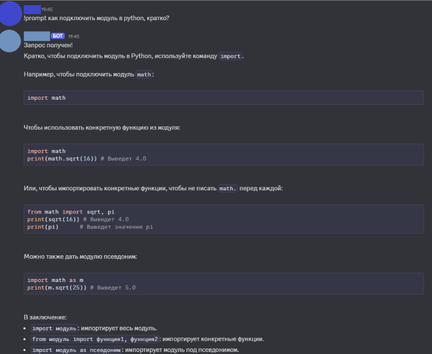

# AI Discord bot
## Russian description:

Простой ИИ бот для Discord, обрабатывающий простые текстовые запросы и запросы с фото
Используемые технологии:
> Python 3.13 
> Discord.py для логики бота 
> OpenRouter для API-токенов к ИИ 
> Gemini ИИ модель от Google для обработки запросов 
> Imgur API для работы с изображениями 

Запуск бота:
> Склонировать данный репозиторий 
> Выпустить необходимые API-токены и заполнить .env файл 
> Создать виртуальное окружение Python >3.13 
> Установить зависимости проекта: pip install -r requirements.txt в виртуальном окружении 
> cd bot
> python main.py

Использование бота:

<b>Инструкции получения токенов для бота позже будут добавлены</b>

## English description:

A simple AI bot for Discord that processes simple text and photo queries
Used technologies:
> Python 3.13 
> Discord.py for bot logic 
> OpenRouter for getting API-tokens for AI 
> Gemini AI Google model for processing requests 
> Imgur API for working with images 

Statring the bot:
> Clone this repository 
> Genarate the necessary API tokens and fill in the .env file 
> Create a Python virtual environment >3.13 
> Install all dependencies: pip install -r requirements.txt in python venv 
> cd bot 
> python main.py 

Example of bot usage:

<b>Instructions for generating tokens for the bot will be added later</b>